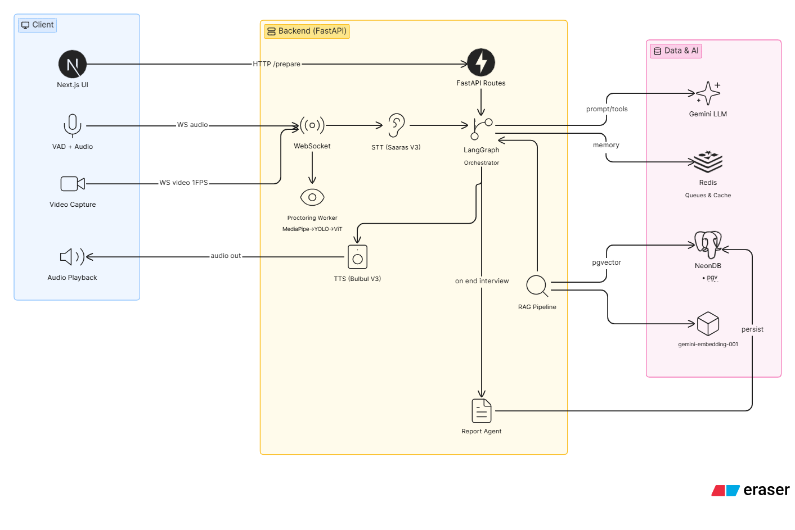

  <h1>🎙️ Bodhi</h1>
  
<strong>A Voice-First, Low-Latency AI Mock Interviewer</strong>

  
Experience structured, hyper-realistic mock interviews conducted entirely by voice. Bodhi listens, evaluates, and dynamically adapts to your answers in real-time.

---

## 🚀 See Bodhi in Action (Demo) [CLICK TO WATCH]

*Watch the end-to-end interview flow, from introduction to the final technical deep-dive.*

---

## 🏗️ How It Works (Architecture)

Bodhi is built for ultra-low latency and stateful conversations. It is orchestrated via LangGraph, streams real-time voice using Sarvam AI, and perfectly handles edge cases through a custom context-memory pipeline.

---

## ✨ Core Features & Showcase

Bodhi isn't just a chatbot; it's a fully integrated interview environment. 

### 1. Integrated Code Editor
When Bodhi asks a coding or Data Structures/Algorithms (DSA) question, an interactive text editor dynamically opens, allowing you to write code while explaining your thought process naturally.

> **[🎥 Insert Text Editor Snippet Here]**
> *(Placeholder: `assets/feature_editor.gif`)*

### 2. Real-Time Proctoring & Behavioral Analysis
Our computer-vision pipeline monitors the candidate at 1 FPS. If a user looks away, opens another tab, or uses a phone, Bodhi's proctoring system flags the violation and updates the candidate's trust rating instantly.

> **[🎥 Insert Proctoring Snippet Here]**
> *(Placeholder: `assets/feature_proctoring.gif`)*

### 3. Dynamic Interview Flow & Cross-Questioning
Bodhi isn't scripted. It gracefully transitions between Intro, Technical, Behavioral, and DSA phases. If an answer is vague, the AI actively challenges the candidate with targeted follow-up questions.

> **[🎥 Insert Dynamic Flow Snippet Here]**
> *(Placeholder: `assets/feature_flow.gif`)*

---

## 📊 Comprehensive Evaluation Report

At the end of the session, Bodhi generates a rigorous, multi-dimensional performance report. It grades candidates across four axes: Accuracy, Depth, Communication, and Confidence, culminating in an agentic hiring recommendation.

> **[🖼️ Insert Final Report Image Here]**
> *(Placeholder: `assets/report_sample.png`)*

---

## ⚙️ Capabilities at a Glance

*   **Resume Parsing & Gap Analysis:** Upload a resume and Job Description. Bodhi automatically finds the gaps and tailors the interview questions to probe specific weak points.
*   **RAG-Powered Context:** Ingests Company and Role profiles to ground the AI's questioning in real-world, company-specific contexts.
*   **Phase Memory Compaction:** As the interview progresses, Bodhi summarizes previous phases, allowing it to naturally reference earlier answers (e.g., *"Earlier you mentioned caching, how would that apply here?"*).
*   **Real-Time Audio Streaming:** Energy-gated Voice Activity Detection (VAD) coupled with auto-chunking ensures natural, hands-free conversation without ever pressing an "Enter" key.

---
*Built to redefine technical and behavioral screening.*
